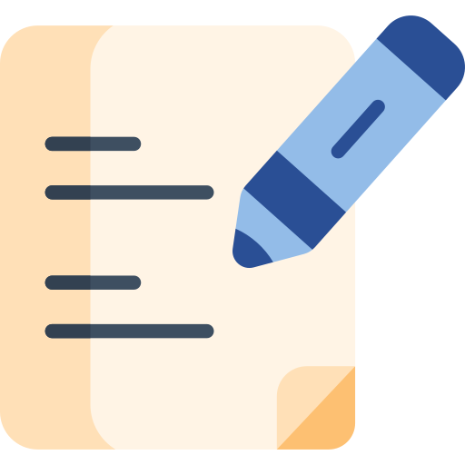

# 📋  Gonote

**Gonote** is a modern, beautifully designed web application specifically crafted for students to manage their academic life. With an intuitive interface and powerful filtering capabilities, Gonote helps you organize assignments, deadlines, schedules, and any important academic notes in one convenient place 📚✨.

> 🎓 The ultimate productivity solution for modern students. Manage all your academic activities with style!

---

## ✨ Key Features

- 📝 **Flexible Note-Taking** – Record assignments, deadlines, schedules, or anything important for your studies
- 🎨 **Modern & Attractive UI** – Eye-catching, user-friendly design for an enjoyable experience
- 🔍 **Smart Filtering** – Easily search and filter notes by category, priority, or date
- 📱 **Responsive Design** – Access from laptop, tablet, or smartphone with optimal display
- 🏷️ **Category System** – Organize notes by subject, assignment type, or custom categories
- ⚡ **Fast Performance** – Smooth loading and responsive navigation
- 💾 **Local Storage** – Data saved securely in browser, no worries about losing notes
- 🌙 **Dark/Light Mode** – Choose theme according to preference and eye comfort

---

## 🛠️ Installation & Setup

### Prerequisites
- [Node.js](https://nodejs.org/) (version 16+ recommended)
- [Git](https://git-scm.com/)
- Modern browser (Chrome, Firefox, Safari, Edge)

### Installation Steps

1. **Clone Repository**
   ```bash
   git clone https://github.com/username/gonote.git
   cd gonote
   ```

2. **Install Dependencies**
   ```bash
   npm install
   ```

3. **Run Development Server**
   ```bash
   npm run dev
   ```

4. **Open Browser**
   Access the application at `http://localhost:3000` 🌐

> **Tip:** Use `npm run build` to create a production build

---

## 🚀 How to Use

### Getting Started with Gonote

1. **Add New Note**
   - Click the ➕ "Add Note" button
   - Fill in note details (title, description, category, deadline)
   - Save and the note will appear on your dashboard

2. **Using Filters**
   - Use filter dropdown to view notes by:
     - Specific subjects
     - Status (completed/pending)
     - Priority (high/medium/low)
     - Deadline dates

3. **Managing Notes**
   - Edit notes by clicking the ✏️ icon
   - Delete unnecessary notes
   - Mark as completed when tasks are done

4. **Customize Display**
   - Toggle between light/dark mode
   - Set up categories according to your needs
   - Adjust layout to your preference

---

## 📚 Student Use Cases

- **Course Assignments** – Track all assignments and deadlines
- **Class Schedule** – Save class timetables and room numbers
- **Exam Notes** – Reminders for midterms and final exams
- **Group Projects** – Coordinate team assignments
- **Campus Activities** – Note events, seminars, or organization activities
- **Personal Notes** – Ideas, reminders, or other important things

---

## 🎯 Technologies Used

- **Frontend**: HTML5, CSS3, JavaScript (ES6+)
- **Styling**: Modern CSS with Flexbox/Grid
- **Storage**: Local Storage API
- **Icons**: Font Awesome / Custom Icons
- **Responsive**: CSS Media Queries

---

## 🤝 Contributing

We welcome contributions from the community! Here's how you can help:

1. Fork this repository
2. Create your feature branch: `git checkout -b feature/amazing-feature`
3. Commit your changes: `git commit -m "Add amazing feature"`
4. Push to the branch: `git push origin feature/amazing-feature`
5. Open a Pull Request with clear description

### Contribution Ideas
- Export/import data functionality
- Google Calendar integration
- Push notifications for deadlines
- Extended theme customization
- Student collaboration features

---

## 📄 License

This project is licensed under the [MIT License](LICENSE). You are free to use, modify, and distribute with proper attribution.

---

## 🙏 Acknowledgments

Thanks to everyone who has provided feedback and contributions to make Gonote better! 

This app was built with ❤️ to help fellow students be more productive and organized.

---

## 📞 Contact & Support

- 🐛 **Report Bug**: Create an issue on GitHub
- 💡 **Feature Request**: Discuss in GitHub Discussions
- 📧 **Email**: [your-email@example.com](mailto:your-email@example.com)

---

## 🌟 Show Your Support

If you find this project helpful, please consider giving it a ⭐ on GitHub! It helps others discover Gonote and motivates us to keep improving.

---

> *"Productivity starts with good organization"*  
> **Gonote** - Your Smart Study Companion 🎓
